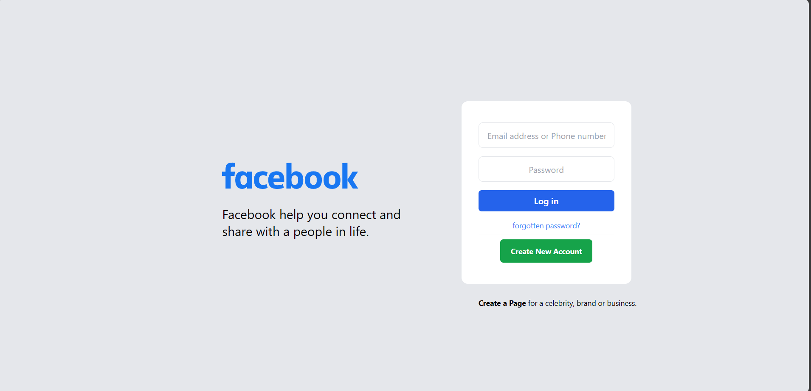

# Facebook Clone with Tailwind CSS



This project is a clone of the Facebook web application, built using HTML, CSS, and Tailwind CSS. It aims to replicate the appearance of the Facebook website.

## Technologies Used

- HTML
- CSS
- Tailwind CSS

## Getting Started

To run this project locally, follow these steps:

1. Clone the repository to your local machine:

   ```bash
   git clone https://github.com/karanwaghh/Facebook-Clone.git
